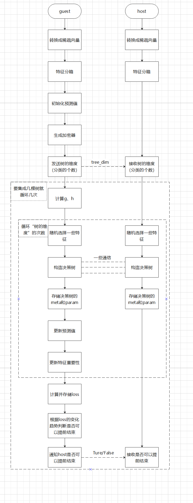
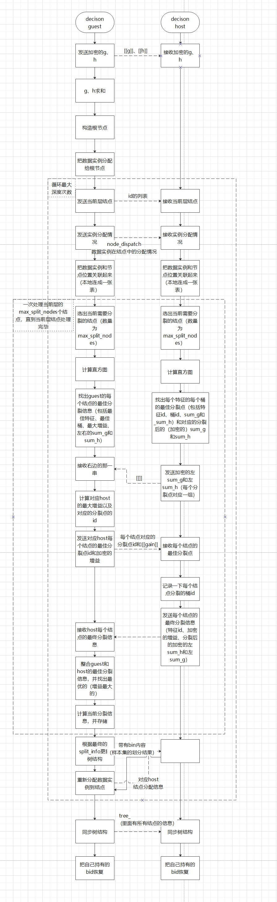

# 流程

写在前面：此处为主要代码的主要流程，具体逻辑请参考 secure boost 和 xgboost 的论文：[[SecureBoost: A Lossless Federated Learning Framework]](https://arxiv.org/abs/1901.08755)、[[XGBoost: A Scalable Tree Boosting System]](https://arxiv.org/abs/1603.02754)

## SecureBoost级fit流程图

## DecisionTree级fit流程图

